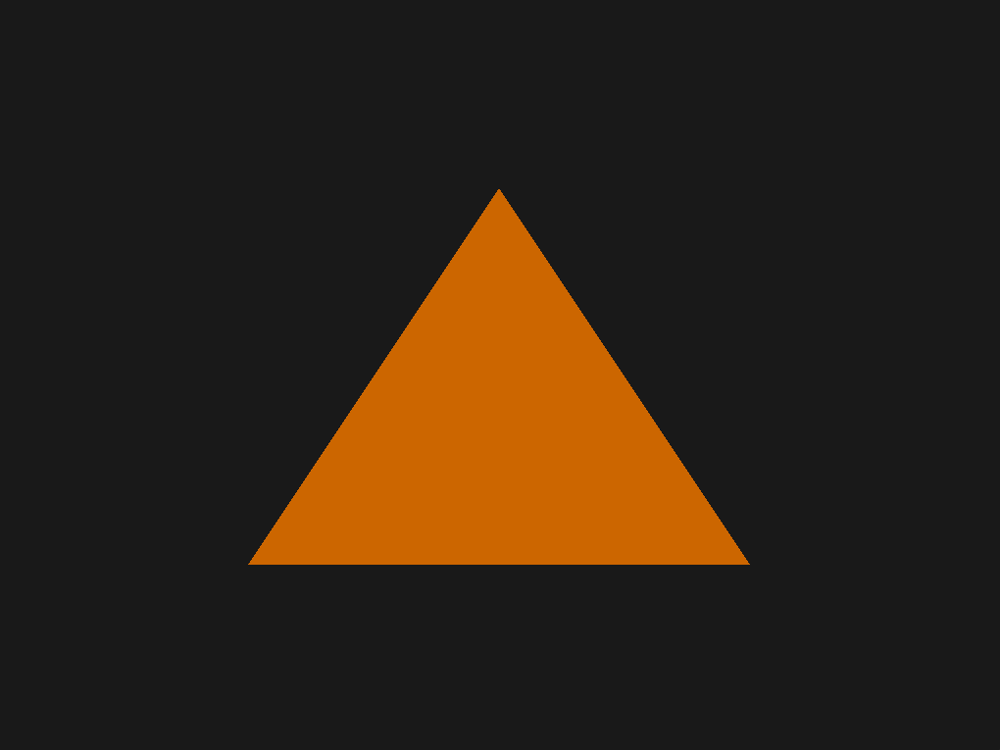

# cpp-opengl-engine

A simple 3D engine built from scratch in C++ using OpenGL and the native Win32 API. No game engine frameworks, no third-party windowing libraries — just raw platform APIs and OpenGL, wrapped in a small, extensible architecture.

> 🚧 **Status: early development.** The engine can open a window, initialize an OpenGL 4.6 core context, and render textured/shaded geometry from external assets. See [Roadmap](#roadmap) for what's next.

## Screenshots



## Features

- **Native Win32 windowing** — no GLFW/SDL, the window is created and managed directly via the Win32 API
- **OpenGL 4.6 Core Profile context**, created through the modern `wglCreateContextAttribsARB` path (via [GLAD](https://glad.dav1d.de/))
- **Vertex buffer abstraction** (`OVertexArrayObject`) wrapping VAO/VBO creation and cleanup
- **Shader system** (`OShaderProgram`) that loads, compiles, and links vertex/fragment shaders from external `.vert`/`.frag` files, with compile/link error logging
- **Platform-agnostic core** — engine logic (`OGame`, `OGraphicsEngine`, ...) is separated from Win32-specific code (`cwin32*.cpp`), in preparation for future Linux/macOS support
- **CMake-based build**, no Visual Studio project files required

## Tech stack

| Component | Choice |
|---|---|
| Language | C++17 |
| Graphics API | OpenGL 4.6 (Core Profile) |
| GL function loader | [GLAD](https://glad.dav1d.de/) |
| Windowing | Native Win32 API |
| Build system | CMake |
| IDE used | Visual Studio 2026 |

## Project structure

```
cpp-opengl-engine/
├── game/
│   └── main.cpp                     # Entry point
├── ogl3d/                           # Engine library
│   ├── include/ogl3d/               # Public headers
│   │   ├── game/                    # OGame: main loop & lifecycle
│   │   ├── graphics/                # OGraphicsEngine, OVertexArrayObject, OShaderProgram
│   │   ├── math/                    # OVec4, ORect
│   │   └── window/                  # OWindow
│   ├── source/ogl3d/                # Implementation
│   │   ├── game/
│   │   │   ├── win32/
│   │   │   │   └── cwin32game.cpp   # Win32-specific: message loop, per-frame render calls
│   │   │   └── ogame.cpp            # Platform-agnostic: lifecycle hooks
│   │   ├── graphics/
│   │   │   ├── win32/
│   │   │   │   └── cwin32graphicsengine.cpp  # Win32-specific: WGL context setup
│   │   │   ├── ographicsengine.cpp  # Platform-agnostic: render commands
│   │   │   ├── oshaderprogram.cpp   # Shader loading/compiling/linking
│   │   │   └── overtexarrayobject.cpp # VAO/VBO creation
│   │   └── window/
│   │       └── cwin32window.cpp     # Win32-specific: window + GL context creation
│   └── vendor/
│       └── glad/                    # Bundled GL/WGL loader
│           ├── include/glad/        # glad.h, glad_wgl.h, glad_glx.h
│           ├── include/KHR/         # khrplatform.h
│           └── src/                 # glad.c, glad_wgl.c, glad_glx.c
├── assets/
│   └── shaders/                     # .vert / .frag shader files
├── CMakeLists.txt
└── .gitignore
```

## Building

### Requirements

- Visual Studio 2022/2026 with the **"Desktop development with C++"** workload
- CMake 3.20+ (bundled with Visual Studio)

### Steps

1. Clone the repository:
   ```
   git clone https://github.com/javiercodev/cpp-opengl-engine.git
   ```
2. Open the folder in Visual Studio (**File → Open → Folder...**). Visual Studio detects `CMakeLists.txt` automatically and configures the project.
3. Select `cpp-opengl-engine.exe` as the startup item and press **F5** to build and run.

No manual dependency setup is required — GLAD is bundled in `ogl3d/vendor/`, and everything else is resolved through Win32/OpenGL system libraries.

## Architecture notes

The engine follows a simple ownership chain:

```
OGame
 ├── owns → OGraphicsEngine   (OpenGL context + render commands)
 └── owns → OWindow           (Win32 window + swap chain)
```

`OGraphicsEngine` is constructed **before** `OWindow`, because it loads the WGL extension functions (via a temporary "dummy" context) that `OWindow` needs to create its real, modern OpenGL context.

Code is split by platform to make future portability easier:
- `ogame.cpp`, `ographicsengine.cpp`, etc. — platform-agnostic logic
- `cwin32game.cpp`, `cwin32window.cpp`, `cwin32graphicsengine.cpp` — Win32-specific implementations

## Roadmap

- [ ] Animations
- [ ] Transformation matrices
- [ ] Texture loading
- [ ] Entity System

## License

No license has been chosen yet — all rights reserved by default. This will be revisited as the project matures.